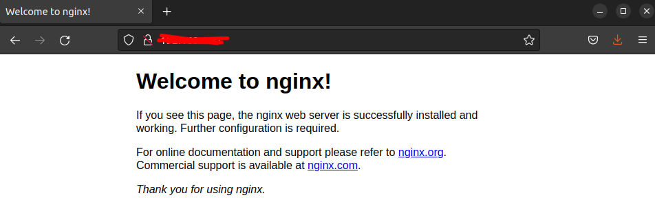
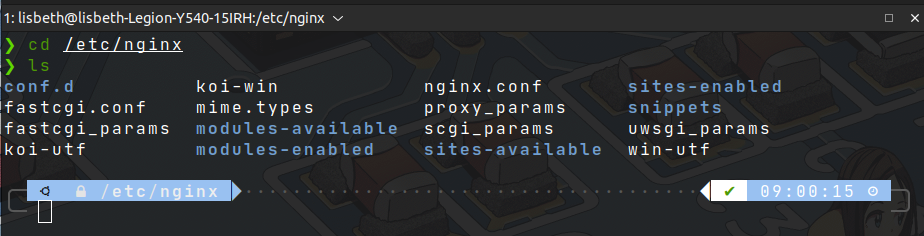
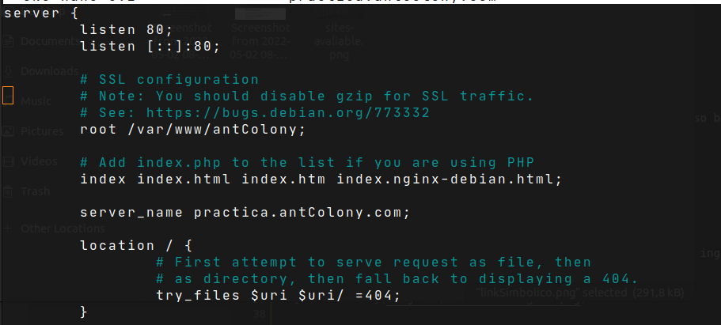
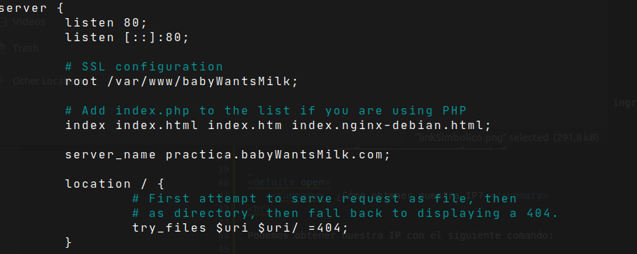
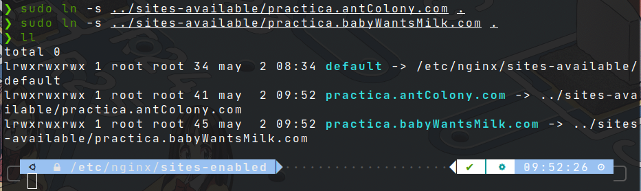
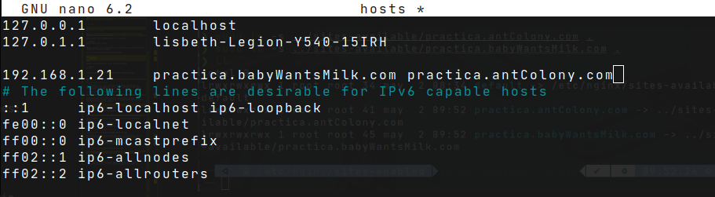
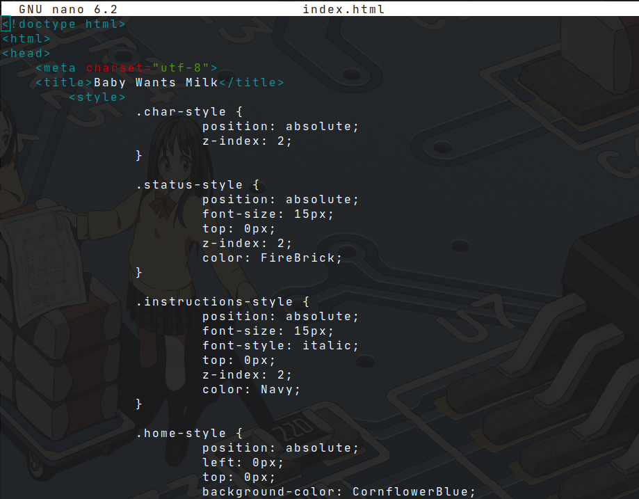
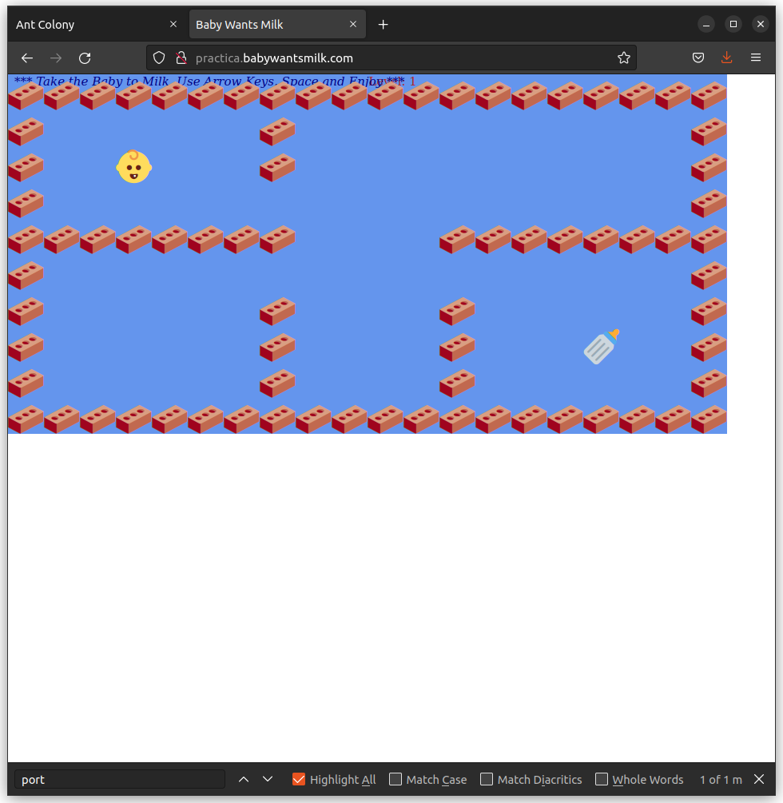
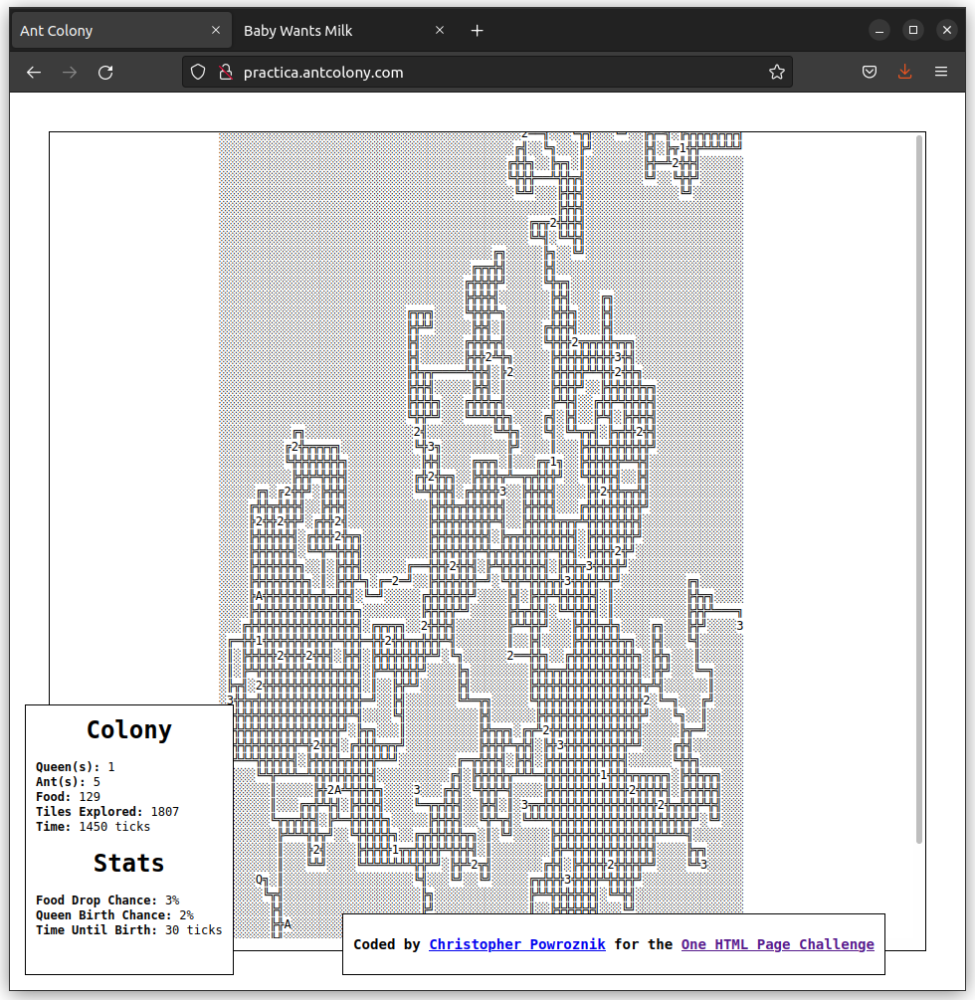

<center>  </center>

# Instalación y configuración del servidor web Nginx Virtual Hosts


<details close>
    <summary>  Instrucción </summary>
<br>
Como hemos visto en clase Ngnix es un servidor web ligero y eficiente. En la presente práctica, primero deberás configurar dos virtual hosts y acceder a ellos usando diferentes subdominios.

Deberéis elegir dos proyectos (HTML + CSS) de esta web: [One HTML page challenge](https://onehtmlpagechallenge.com/) y desplegarlos en dos subdominos distintos, tal y como vimos el último día antes de irnos de vacaciones,  siguiendo la vídeo guía que os adjunto.

Deberéis documentar el proceso en formato markdown en un README.MD, con capturas de pantallas incluidas, y hacerme llegar el repositorio en esta tarea.
    
[Video Referencia](https://www.youtube.com/watch?v=_LQv96MdtCk)

### Notas

```
Haré esta instalación en un Ubuntu. 
```

</details>


## Instalación de Nginx

Nginx es un servidor web de código abierto diseñado para un uso bajo de memoria y una alta concurrencia. 

Para instalar Nginx debemos realizar lo siguiente:

```console
sudo apt-get install nginx
```

Podemos comprobar si la instalación se ha realizado con éxito ingresando a nuestra IP en nuestro navegador:




<details close>
    <summary>  ¿Cómo obtener nuestra IP? </summary>
<br>

Podemos obtener nuestra IP con el siguiente comando:

```console
ip addr
```


</details>

<br>

## 🔨 Configuración de Nginx

El directorio `/etc/` es el encargado de almacenar los archivos de configuración de los programas. Por lo que nos dirigimos a este dónde debería estar la carpeta de *Nginx*:



En la carpeta de *Nginx* encontramos la carpeta *sites-avaliable* 

Donde encontramos el archivo *default*. Este archivo contendrá la configuración del servidor. Ahora bien lo copiamos para crear dos páginas nosotros con el siguiente comando:


```console 
sudo cp default practica.antColony.com

sudo cp default practica.babyWantsMilk.com
```

Así tendremos dos subdominios donde podremos tener diferente contenido. 

Ahora procedemos a modificar la configuración de los dos subdominios creados.

Primero modificaremos el subdominio `practica.antColony.com`:



Y después `practica.babyWantsMilk.com`:



Debemos activar estos sitios realizando un link simbólico de los archivos de `sites-avaliable` a `sites-enabled` haciendo lo siguiente:

```console
sudo ln -s ../sites-available/practica.antColony.com .
sudo ln -s ../sites-available/practica.babyWantsMilk.com .
```




Ahora recargamos *Nginx* para que carge las nuevas configuraciones:

```console
sudo nginx -s reload
```

Ahora, para que nuestro navegador apunte a nuestra IP es necesario modificar el archivo `host` que se encuentra en `/etc/host/`:



Una vez hecho esto, creamos las carpetas *antColony* y *babyWantsMilk*:

```console
sudo mkdir /var/www/antColony
sudo mkdir /var/www/babyWantsMilk
```
Una vez hecho esto ingresamos el código fuente extraido de el sitio [OneHTMLPage](https://onehtmlpagechallenge.com/):


<details close>
    <summary>  📃Código fuente </summary>
<br>




</details>

## 🎯Resultado 

Ahora si ingresamos al navegador podemos ver que en los dominios *http://practica.babywantsmilk.com/* y *http://practica.antcolony.com/* nos aparece lo siguiente:

 

<br>




## 🖇Creditos

[BabyWantsMilk.html](https://github.com/Metroxe/one-html-page-challenge/blob/master/entries/BabyWantsMilk.html)

[ant_colony.html](https://github.com/Metroxe/one-html-page-challenge/blob/master/entries/ant_colony.html)

